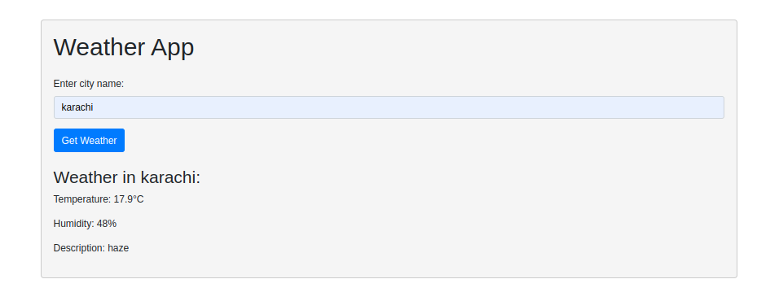

This program is a simple weather application built with Flask, a Python web framework, and the OpenWeatherMap API.

The user interface is a single page where a user can enter the name of a city. When the user submits the form, the application makes a request to the OpenWeatherMap API to fetch the current weather data for the specified city.

The weather data includes the temperature, humidity, and a brief description of the weather. If the city is found, the weather data is displayed on the page. If the city is not found, an error message is displayed instead.

The application uses the Bootstrap CSS framework for basic styling. The layout is responsive and should work well on both desktop and mobile browsers.

#huggingfacelink
https://huggingface.co/spaces/fahad56/weatherapps

